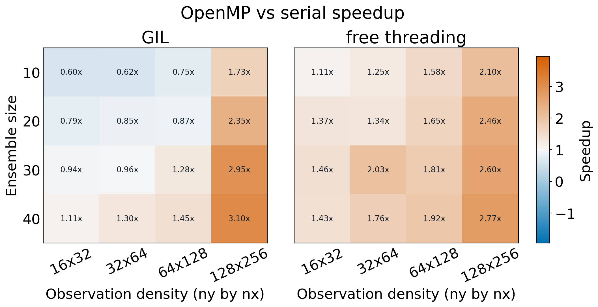
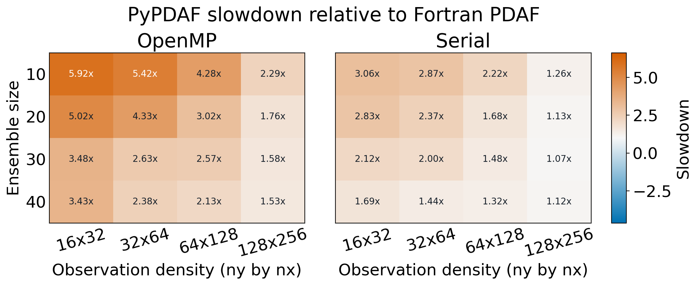

# OpenMP benchmarks

The following benchmarks compare pyPDAF configurations across ensemble sizes
and observation-grid densities. They are representative measurements from the
`openmp_test` benchmark rather than performance guarantees; results depend on
the processor, MPI implementation, OpenMP runtime, and thread placement.

## OpenMP speedup

Each cell reports the serial pyPDAF runtime divided by the runtime of the
corresponding OpenMP build. Values above `1x` therefore indicate a speedup,
while values below `1x` indicate that the OpenMP build was slower. The two
panels show standard GIL-enabled Python and free-threaded Python.

## Python and Fortran comparison

Each cell reports the pyPDAF runtime divided by the runtime of the matching
Fortran PDAF benchmark. A value of `1x` indicates equal runtime, and a larger
value indicates that pyPDAF was slower. The panels compare OpenMP-enabled and
serial runs separately.
